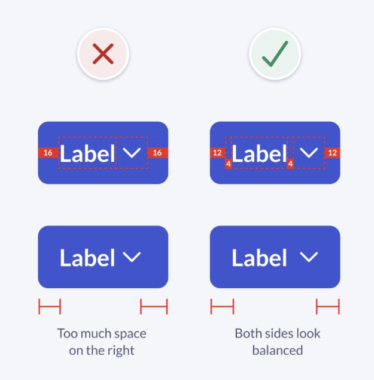

# Buttons

## B1 · Visually balanced padding

A button with an icon should look as if it has the same space on both sides. Equal padding does not achieve that, because the icon brings empty space of its own and makes its side look wider. The way out is to move part of the padding off the edges and into a frame around the label.

**An example**
- The label is wrapped in an Auto Layout frame with 4 px padding left and right.
- The button has 12 px padding left and right.
- The icons sit next to the label frame, each shown by a boolean. This works for one icon and for two.
- In the picture, the label frame and the icon frame touch. The label frame's 4 px is the space between them. *(Read from the image.)*

**Why it works**
- An icon is drawn inside a square box, and the drawing never fills it. A chevron, for example, leaves several pixels empty on each side.
- So on the icon side, the space you see is the button padding plus the icon's empty space. On the text side, the letters start almost at the edge of their box.
- With 16 px on both sides, the icon side looks wider, and the button feels heavy on the right.
- With 12 px and a 4 px label frame:
  - the text side still shows 16 (12 + 4);
  - the icon side shows 12 plus the icon's empty space, which comes out close to 16;
  - both sides read the same.
- The label frame also keeps the text in the same place when icons are switched on or off. A label-only button still has 16 on each side.

**What to look for**
- On a button with a trailing icon, the space left of the text and right of the icon looks equal.
- The label doesn't jump when an icon is switched on.
- The label is wrapped in its own small frame, never a bare text layer next to the icons.

**Related specs:** `parts/2.1-button.md` §3 (the `Text padding` wrapper and its reason), `components/3.1-button-group.md`, `components/3.7-social-button.md`. The specs set their own values: the same idea with different numbers.
**Source:** maintainer, 2026-10-09
