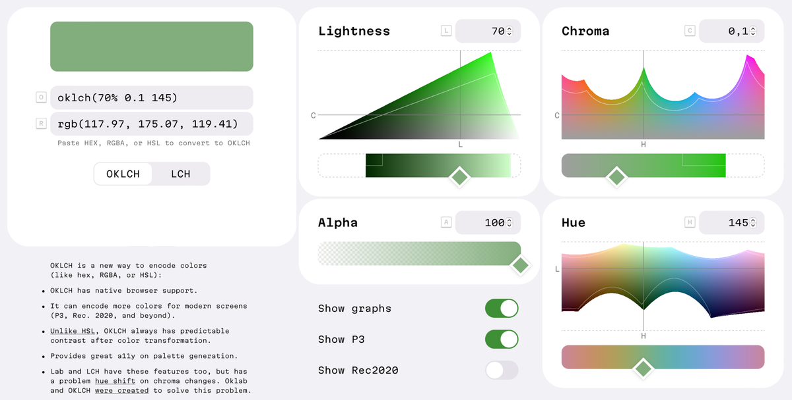

# Color

## C1 · When the brand doesn't choose, think in OKLCH

When a brand gives no colors, or only one or two, the rest of the palette has to be made. OKLCH makes that a formula instead of a long run of manual picks.

**An example**
- `oklch(70% 0.1 145)` is `rgb(118, 175, 119)`: a soft, muted green.
- You can read it straight from the numbers:
  - **70%** is the lightness: fairly light;
  - **0.1** is the chroma: low, so muted rather than vivid;
  - **145** is the hue angle: green.
- No one can read that from `#76AF77`.

The four parts of a value:

| Part | What it is | Range |
| --- | --- | --- |
| L | lightness as the eye sees it | 0–1 (or 0–100%) |
| C | chroma: from gray to the most saturated color | 0 to about 0.37 |
| H | hue angle | 0–360 |
| a | opacity (optional, after a slash) | 0–1 (or 0–100%) |

**Why it works**
- **A palette from a formula.** Choose a few colors, define how the steps move (lightness down the scale, chroma easing off at the light and dark ends), and the whole palette follows. Every family is built the same way, so the families match each other. *(The chroma easing is an interpretation of "define a formula".)*
- **It reads like a description.** Lightness, colorfulness and hue are things a designer already thinks in, so a value can be checked by eye before anyone looks at a swatch.
- **More colors on modern screens.** Wide-gamut displays (P3 and beyond) can show colors that sRGB monitors can't, and OKLCH can describe them.

## C2 · Lightness you can trust

The L in OKLCH is perceived lightness. Two colors with the same L look equally light, whatever their hue.

**An example**
- In HSL, a yellow and a blue both at 50% lightness look nothing alike: the yellow reads far lighter.
- Darkening a color with an HSL-based tool (the old `darken()` of preprocessors) gave uneven, surprising results.
- In OKLCH, the same L across hues gives steps that line up: the 600 of every family reads about equally dark.

**Why it works**
- When lightness is predictable, contrast is predictable too. Text that passes on one family's step will pass on the same step of another, which makes accessible palettes easier to generate and to keep accessible after a change.
- Plain Lab and LCH also measure lightness by eye, but their hue drifts when chroma changes: a blue made less vivid starts turning purple. Oklab, the space OKLCH is built on, was made to fix that, so lowering chroma keeps the hue.

**What to look for**
- Put the same step of every family side by side. They should read as one row of equal lightness.
- The contrast results of the same step should be close across families.

## C3 · Mind the screen

Not every combination of L, C and H can be shown on every screen.

**An example**
- A very vivid color at a very light or very dark lightness falls outside what an ordinary sRGB monitor can show.
- The browser then shows the closest color it can, which may not be the one intended.

**Why it matters**
- A palette that looks right on a wide-gamut laptop can shift on an older monitor. Check the colors in an OKLCH color picker that shows the sRGB and P3 limits, and keep the colors you rely on (text, solid fills) inside sRGB.
- **The tools are still catching up.** When this was written (2024), browsers supported OKLCH natively, but some design tools needed a plugin, and support has changed since. Where a tool stores colors as RGB or hex, keep the OKLCH value as the source and treat the stored value as its conversion. *(Interpretation.)*

**What to look for**
- No color the system depends on is clipped on an sRGB screen.
- The OKLCH value of each primitive is recorded next to its hex.

**Related specs:** `foundations/1.1-color.md`: the palette families, the 11 default steps (`50`–`950`), the semantic roles and the contrast checks. A brand's own colors always stay as they are; this reasoning applies only to the colors the brand leaves open.
**Source:** maintainer, 2026-10-09
