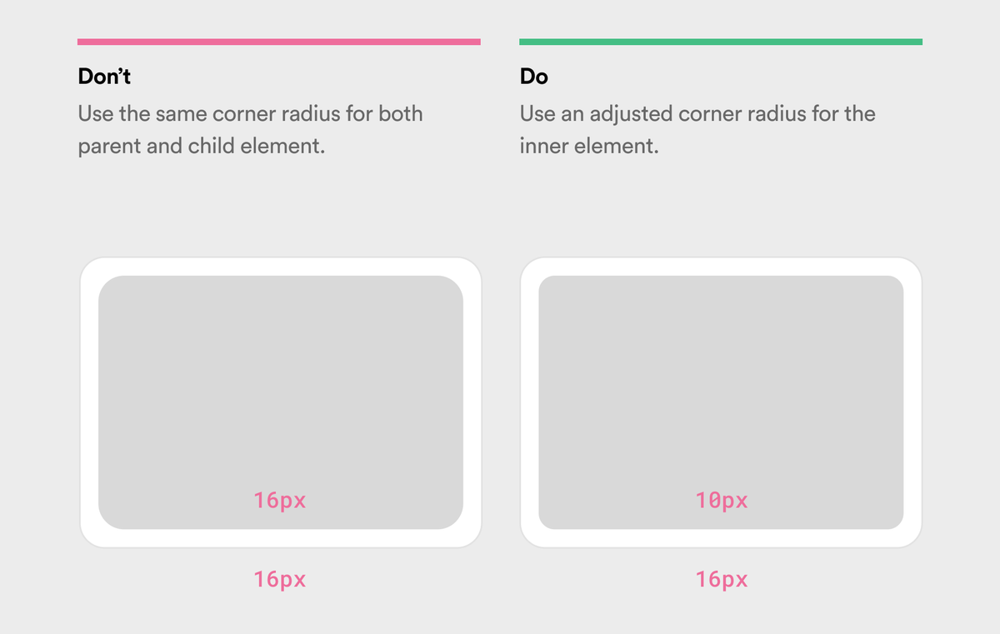
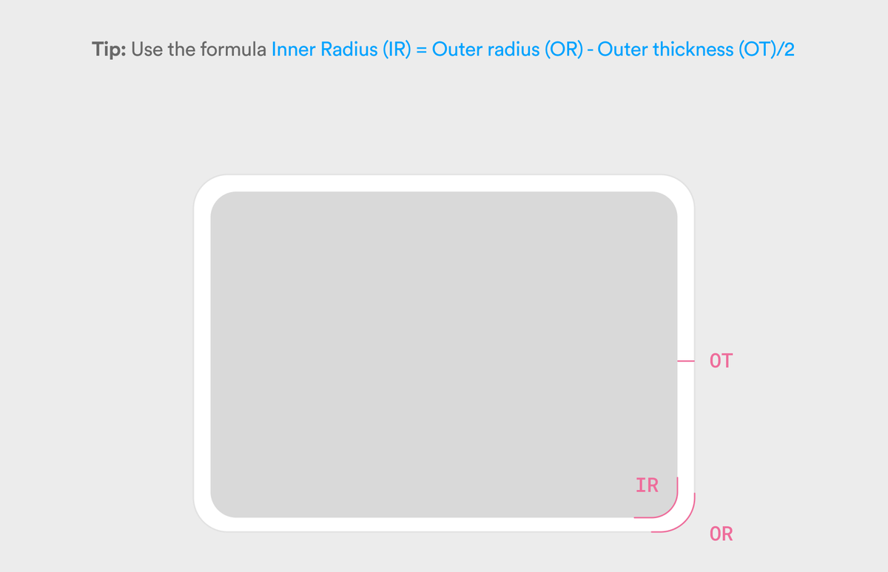

# Radius

## R1 · Inside a rounded shape, the inner radius is smaller

When one rounded shape sits inside another, the inner corner needs a smaller radius than the outer one. The inner radius is the outer radius minus the gap between them.

**An example**
- An outer container has a 50 px radius and 20 px of padding, so the inner element gets 30 px (50 − 20).
- A card with 16 px outer corners holds a panel with 10 px corners. *(Read from the image.)*
- A softer version subtracts only half the gap: inner radius = outer radius − gap ÷ 2. The 16 → 10 pair above fits this version better than the full subtraction. *(Interpretation, measured from the image.)*

  
- It works in reverse. Start from the inner element, often a button, and add the padding to get the outer radius: inner radius + padding = outer radius.
- When the padding is larger than the outer radius, the formula goes below zero. For example, a dialog with a 12 px radius and 16 px padding gives 12 − 16. The inner element then:
  - keeps its own radius from the scale, as a button inside a dialog does;
  - or, when it is a plain panel, gets a small radius: 2–4 px often looks better than a hard 0.

**Why it works**
- Two corners with the same radius, one inside the other, aren't parallel.
- The gap between them is wider at the corner than along the sides. The eye notices that unevenness even when it can't say what is wrong, so the design looks like a mistake.
- With the inner radius reduced by the gap, the two curves share one center, and the gap stays the same all the way round. That reads as intentional.
- Subtracting the full gap makes the curves exactly parallel, but on a thick gap the inner corner can turn quite sharp. Subtracting half keeps the inner corner softer, while still closing most of the uneven gap. The choice is a matter of judgment. *(Interpretation.)*
- When the gap is wider than the outer radius, the two corners are too far apart to read as a pair, so the inner one can follow its own size instead. *(Interpretation.)*

**What to look for**
- Around every nested corner (a card and its image, a dialog and its panel, an input and the tag inside it), the gap is even, not wider at the corner.
- An image at the edge of a rounded card is clipped to the card's corners. A square image corner poking out of a rounded card looks broken.

## R2 · Radius grows with size

Bigger elements get bigger radii, and elements of a similar size share one radius.

**An example**
- Group elements by their **shortest side**. A 200 × 40 button belongs with the 40 px elements, not the 200 px ones.

  | Group | Shortest side |
  | --- | --- |
  | Tiny | under 16 px |
  | Small | 16–32 px |
  | Medium | 32–56 px |
  | Large | 56–100 px |
  | Extra large | 100 px and up |

- Give each group a named step, not a number. A named step can change in one place, and every component that uses it follows:

  | Step | Value | For |
  | --- | --- | --- |
  | None | 0 | tables, technical interfaces, editorial layouts |
  | XS | 2 | checkboxes, tiny indicators, inline badges |
  | S | 4 | chips, small buttons, tags, tooltips |
  | M | 8 | cards, input fields, standard buttons, dropdowns |
  | L | 12 | large cards, modals, dialogs |
  | XL | 16–24 | hero sections, large containers, bottom sheets |
  | Full | 9999 | pill buttons, avatars, status indicators |

- Once the steps are set, work out each nested pair with R1 and write it down, so nobody has to guess it later.

**Why it works**
- A radius reads relative to the size of the shape.
  - 16 px on a 32 px chip turns it into a pill.
  - The same 16 px on a 400 px card barely looks rounded.
- One radius applied everywhere therefore looks different on every element. A radius per size group makes them all look equally rounded.

**What to look for**
- Small things never look like pills by accident, and large containers don't look square.
- Elements of the same size use the same named step.

## R3 · Borders change the curve

A border adds thickness to a corner. Where the border sits decides which radius it needs.

**An example**
- **A border inside the element** follows the element's own radius.
- **A border outside the element** adds its width to the radius: an 8 px corner with a 2 px outer border has a 10 px outer edge.
- Give border radii their own names (for example "M Border"), so they aren't confused with shape radii.

**Why it works**
- The same rule as R1 applies: two edges that run together should stay parallel.
- A border's outer edge that keeps the inner radius pinches at the corner, the way nested shapes do.

**What to look for**
- The thickness of a border stays even around its corners.
- Focus rings and outlines drawn outside a control are rounder than the control by their own width.

## R4 · Radius sets the tone

The size of the corners changes how an interface feels, before anyone reads a word.

**An example**

| Radius | Feels | Often used for |
| --- | --- | --- |
| 0 (sharp) | technical, rigid, editorial, authoritative | news sites, enterprise tools, data dashboards |
| 2–4 (subtle) | professional, structured, business-like | business software, banking, corporate sites |
| 8–12 (moderate) | balanced, modern, versatile | e-commerce, social platforms, general apps |
| 16–24 (large) | friendly, cozy, approachable, informal | consumer apps, apps for children, wellness |
| Full pill | playful, modern, mobile-first | chat, social media, creative tools |

- Banking and finance lean on 2–4 px, so the interface feels precise and trustworthy.
- Social products lean on 12–20 px, to feel inviting and casual.
- Games often mix sharp and rounded corners, to create energy.

**Why it works**
- Soft corners read as friendly and approachable. Sharp corners read as firm, and are said to create a slight sense of tension.
- People are sensitive to this: a 2 px change in radius across a whole interface can change how it feels.
- So choosing a radius isn't only a style preference. It's a decision about how the product should feel to its audience.

**What to look for**
- The radius matches what the audience expects of the product, and the brand's character.
- The whole interface keeps to that character; it doesn't drift between sharp and soft screen by screen.

## R5 · Round with intent

Radius is a tool for hierarchy and grouping, not a finish applied to everything.

**An example**
- Rounding everything the same way makes elements blend together. Keep sharp corners for things that should feel structured (tables, code blocks, data grids), and use rounded corners for interactive and friendly elements.
- Siblings at the same level match. Two buttons side by side share a radius, and so do two cards in one grid. Consistency within a group matters more than having one "correct" radius for the whole system.
- Shape can separate actions. A primary button as a pill next to a rectangular secondary button shows which is the main action by shape, not by color alone. If both are pills and only the color differs, the difference is weaker.

**Why it works**
- The eye groups things that look alike. Matching radii say "these belong together", and a different radius says "this is something else".
- A sharp element beside a rounded one at the same level looks like an accident rather than a choice, and creates tension where none was meant.

**What to look for**
- Every group of siblings shares one radius.
- When two elements differ in radius, there is a reason you can name.

**Related specs:** `foundations/1.4-shape.md`: the radius steps by role (control, surface, modal, indicator), and the nested-radius visual, where outer = inner + padding. The spec sets the system's own steps, named by role rather than by size.
**Source:** maintainer, 2026-10-09
